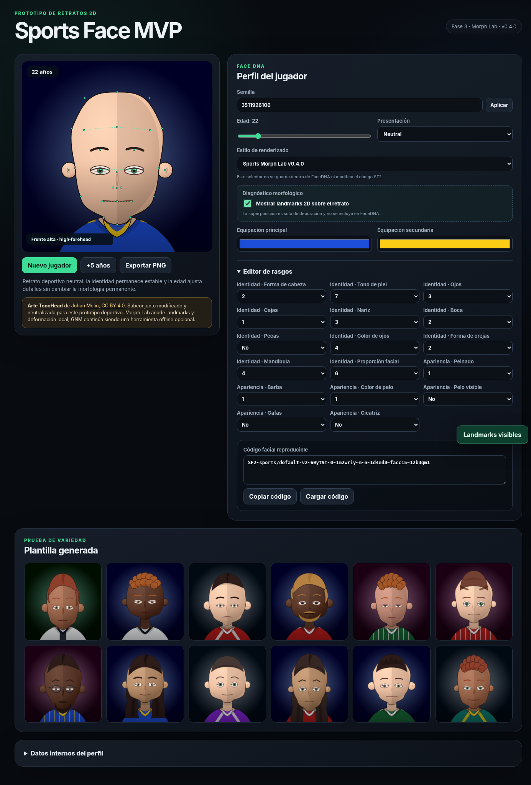

# Sports Face MVP



Sports Face MVP es un prototipo web para generar retratos 2D reproducibles de jugadores ficticios para un juego de gestión deportiva. La versión pública actual es `v0.4.0`: incluye FaceDNA v2, edición de rasgos, envejecimiento, equipación, galería, exportación PNG y cinco opciones de renderizado.

**Estado:** prototipo técnico funcional, no producto de producción. La distribución abre el retrato con un bundle offline. Morph Lab GNM es una integración experimental: el pack actual usa 200 cabezas, 31 landmarks provisionales, 14 features y 8 familias. Los landmarks todavía requieren revisión y no constituyen un mapeo anatómico validado.

## Inicio rápido

### Abrir la distribución

Abre `index.html` directamente en un navegador. El bundle clásico incluido es compatible con URLs `file://` y no necesita un servidor local ni instalar dependencias para probar la aplicación.

### Desarrollo modular

Desde la raíz del repositorio, inicia un servidor HTTP:

```bash
python3 -m http.server 8080
```

Abre [http://localhost:8080/index.module.html](http://localhost:8080/index.module.html). Esta entrada carga `src/app.js` y el pack portable GNM generado para la entrada modular. En Windows también está disponible `iniciar-servidor.bat`.

### Publicación en GitHub Pages

El workflow de GitHub Pages ejecuta `npm test` antes de preparar y publicar el sitio estático en cada push a `main` o mediante ejecución manual. Después de que termine el workflow, la URL pública estará disponible en [GitHub Pages](https://nicoruedaa.github.io/sports-face-mvp/); no se considera publicada hasta completar esa ejecución.

## Renderizadores

El selector de la interfaz no forma parte de FaceDNA ni modifica el código SF2. La opción GNM es explícita: selecciona `Sports Morph Lab GNM v1` (`sports/morph-gnm-v1`) cuando quieras probar el pack portable.

| Opción | Identificador | Descripción |
| --- | --- | --- |
| Default | `sports/default-v2` | Renderizador Canvas 2D original, basado en las variantes FaceDNA y los assets vectoriales provisionales. Es la opción inicial si no existe una preferencia guardada. |
| Toon Polish | `sports/toon-prototype` | Pulido visual basado en el subconjunto modificado de ToonHead: expresiones neutralizadas, pelo, barba, gafas, envejecimiento y equipación deportiva. |
| Morph Lab analítico | `sports/morph-v1` | Deformación morfológica 2D determinista con 8 familias, landmarks y deformaciones locales. Usa el starter pack analítico, independiente de GNM. |
| Morph Lab GNM | `sports/morph-gnm-v1` | Usa el pack morfológico portable generado offline a partir de datos derivados de GNM. La asignación de familias aplica un mapeo semántico revisado de FaceDNA. Es opt-in y no carga GNM en el navegador. |
| Morph Lab WebGL2 | `sports/morph-webgl-v1` | Prototipo opt-in geometry-only que carga un GLB portable con base y 16 targets PCA derivados de geometría. Usa WebGL2 sin dependencias, encuadre bounded, depth test y sombreado GLSL simple; cae al renderer GNM SVG si el contexto o el asset no están disponibles. No es production-ready. |

Morph Lab ofrece microexpresiones deterministas (`neutral`, `alert`, `soft`, `focused`, además de `auto`) derivadas de `eyes`, `brows` y `mouth`. Son ajustes visuales sutiles, no animación, y no cambian FaceDNA.

La Fase 2 exporta offline la malla template retenida a
`tools/gnm/work/head.glb`. Es un GLB geometry-only para inspección: no implementa
WebGL ni cambia el runtime o el comportamiento SVG.

### Fase 3: reducción offline de morph targets

La primera slice acotada de Fase 3 genera `tools/gnm/work/gnm-morph-targets.json`
y su payload `gnm-morph-targets.bin` desde las 200 mallas neutrales retenidas.
Es un prototipo derivado de geometría, no controles semánticos oficiales de GNM.
No añade WebGL, carga en navegador ni integración de morph targets en el GLB; el
renderer SVG continúa siendo el predeterminado y `src/` no cambia.

El builder verifica las claves y formas del NPZ: `identities` es `(200, 253)` y
no es mesh data, por lo que usa `vertices` `(200, 17821, 3)` y registra esa
decisión en la procedencia. Si no encuentra mallas válidas, termina sin generar
targets. El paquete acepta de 12 a 20 targets y usa los IDs neutrales
`gnm-pca-01` ... `gnm-pca-16`. La salida actual conserva `95.2596%` de varianza,
con residual `4.7404%`, RMSE `0.0172562` y error absoluto máximo `0.147963`.

```bash
npm run build:gnm-morph-targets
npm run test:gnm-morph-targets
python tools/gnm/validate_gnm_morph_targets.py tools/gnm/work/gnm-morph-targets.json
npm run build:gnm-glb-morph
npm run test:gnm-glb-morph
python tools/gnm/validate_gnm_glb.py tools/gnm/work/head-morph.glb
```

La integración GLB usa `template + meanDelta` como base y añade 16 deltas PCA en
orden estable. Los nombres son neutrales y los pesos del renderer son una
proyección bounded determinista de las variables de identidad permanente
`head`, `skin`, `eyes`, `brows`, `nose`, `mouth`, `freckles`, `eyeColor`,
`earShape`, `jaw` y `faceProportion`. Esta fase hace cumplir el contrato de que
la geometría WebGL depende solo de identidad: apariencia, edad, presentación,
equipación, expresión y semilla no alteran los pesos cuando `identityBits` es
el mismo. No son controles anatómicos ni componentes PCA semánticos. WebGL2 es
un prototipo opt-in, GNM no entra en runtime y SVG sigue siendo el camino
predeterminado.

### Comparativa visual A/B SVG/WebGL2

La evidencia canónica de la comparación bounded está en
[`docs/gnm-webgl-ab/`](docs/gnm-webgl-ab/) y su contrato está en
[`docs/ACCEPTANCE_GNM_WEBGL_AB.md`](docs/ACCEPTANCE_GNM_WEBGL_AB.md). Usa ocho
semillas fijas con los mismos perfiles FaceDNA, edad `22`, presentación neutral y
microexpresión neutral. SVG GNM es la referencia/aceptación; WebGL2 es opt-in y
geometry-only. La comparación es cualitativa/diagnóstica, no pixel equivalence,
porque ambos renderers tienen distinto sombreado y proyección.

```bash
npm run capture:gnm-webgl-ab
npm run validate:gnm-webgl-ab
```

La ausencia de WebGL2 se reporta honestamente como `fallback` o `unavailable`,
nunca como un PASS fabricado. Persisten las limitaciones de no tener UVs,
texturas, ojos, dientes, lengua ni animación; los IDs PCA neutrales no son
controles semánticos. La evidencia también registra dimensiones, ocupación y
bounding box mediante una sonda `readPixels` WebGL2 y un decodificador PNG stdlib;
son métricas proporcionales de salud/framing, no una afirmación de corrección
anatómica o semántica.

### Intake de bundle oficial GNM

La siguiente slice añade una puerta de procedencia y licencia para un futuro
bundle oficial, sin descargarlo ni redistribuirlo. El ejemplo es un manifest
`proposed` con placeholders y `runtimeAllowed: false`:

```bash
npm run validate:gnm-official-example
npm run test:gnm-official-bundle
python3 tools/gnm/validate_official_bundle.py /path/to/official-bundle.json
```

Los estados son `proposed` -> `reviewed` -> `accepted`. La aceptación exige
archivos completos y hasheados para mesh, UVs, materiales/texturas, ojos,
dientes y lengua, topología consistente, evidencia de licencia y una decisión
humana explícita de redistribución. No se infiere permiso desde la licencia del
repositorio. No se añaden UVs, texturas, ojos, dientes o lengua al
navegador/runtime antes de `accepted`; esta fase no aceptó ni redistribuyó
assets oficiales. El contrato completo está en
[`docs/ACCEPTANCE_GNM_OFFICIAL_BUNDLE.md`](docs/ACCEPTANCE_GNM_OFFICIAL_BUNDLE.md).

## Estado de GNM

GNM es **solo offline** en este proyecto. El navegador y el runtime no instalan, importan ni ejecutan GNM. El límite entre ambos es un JSON portable: el pipeline offline genera `tools/gnm/work/gnm-morphology-pack.json`, y `npm run build:offline` lo inyecta en `src/app.bundle.js` y escribe también `tools/gnm/work/gnm-morphology-pack.js` para la entrada modular.

El estado actual del pack es:

- 200 cabezas muestreadas de forma determinista.
- 31 landmarks del mapa de vértices actual, todos provisionales.
- 14 features morfológicas: anchuras de cráneo, mejillas, mandíbula y barbilla; alturas y proporciones faciales; separación, anchura y altura de ojos; longitud y anchura de nariz; anchura de boca; separación de orejas; y pendiente de sienes.
- 8 familias agrupadas con clustering determinista.
- Mapeo semántico `face-dna-shape-v1` basado únicamente en `head` y `faceProportion`, con reglas explícitas y revisadas. No es un mapeo aprendido ni se deriva de la semilla.
- Microexpresiones deterministas compartidas por los dos estilos Morph Lab.

La puerta de calidad de landmarks es deliberadamente report-only: amplía la
evidencia con excursiones de proyección, extremos de malla cruda y procedencia
de nombres de archivo, pero no corrige IDs ni demuestra corrección anatómica.
El reporte siempre conserva `provisionalReview: required` y
`anatomicalCorrectness: not_proven`. El drift actual entre `heads-test.npz` en
el mapa y `gnm-heads-200.npz` en los artefactos se informa como WARN porque los
landmarks canónicos y retenidos son idénticos byte a byte.

### Fase 2: exportación GLB offline

Con el entorno externo de GNM activado (debe aportar NumPy), exporta y valida la
malla template retenida:

```bash
npm run build:gnm-glb
npm run test:gnm-glb
python tools/gnm/validate_gnm_glb.py tools/gnm/work/head.glb
```

El resultado actual contiene 17.821 vértices, 35.324 triángulos y 105.972
índices. El NPZ retenido no contiene UVs, texturas, ojos, dientes, lengua ni
morph targets; esos datos solo deben incorporarse desde datos oficiales de GNM
en una fase posterior. `npm test` no ejecuta este paso porque requiere NumPy y
GNM no es una dependencia del proyecto.

La provisionalidad del mapa es un límite conocido: los índices fueron seleccionados como anclajes de superficie a partir de inspección de la malla y varias zonas no tienen etiquetas anatómicas semánticas. Cualquier promoción de un pack debe revisar el mapa y los datos generados antes de incorporarlos al runtime.

### Regeneración reproducible del pack

El proyecto no instala GNM como dependencia npm o Python. Instala GNM Shape desde su repositorio oficial en un entorno separado de Python 3.13 y actívalo solo para la generación offline. Mantén ese checkout y su entorno fuera de este repositorio.

Desde la raíz del proyecto y con ese entorno activado, genera primero un candidato:

```bash
source /path/to/gnm/shape/.venv/bin/activate
python tools/gnm/build_runtime_pack.py \
  --count 200 --seed 400 --sigma 1.15 --families 8
```

El candidato queda en `tools/gnm/work/gnm-morphology-pack-200.json`. Revisa `tools/gnm/work/gnm-vertex-map.json`, la muestra de landmarks y el candidato. La primera ejecución no reemplaza el pack canónico.

Después de la revisión humana, promueve explícitamente el candidato y regenera los artefactos:

```bash
python tools/gnm/build_runtime_pack.py \
  --count 200 --seed 400 --sigma 1.15 --families 8 --promote
npm run build:offline
npm test
npm run test:gnm-quality
npm run refresh:release
python3 -m json.tool docs/release-manifest-v040.json >/dev/null
```

`--promote` es obligatorio para copiar el candidato al pack canónico. `npm run build:offline` es el paso que cruza la frontera hacia el navegador. `npm run refresh:release` actualiza los hashes del manifiesto operativo. Para comprobar la instantánea distribuida, ejecuta:

```bash
sha256sum -c SHA256SUMS.txt
```

La verificación completa de `SHA256SUMS.txt` solo es válida cuando el archivo de checksums corresponde exactamente a la instantánea que se está comprobando. Después de cambiar archivos operativos, actualiza los metadatos de release antes de publicar una nueva instantánea.

## Qué incluye el MVP

- FaceDNA v2 con identidad y apariencia codificadas en un código SF2 reproducible.
- Variables de tipo `sprite`, `palette` y `toggle`, con edición individual de rasgos.
- Semilla determinista, importación y exportación del código facial.
- Separación entre identidad permanente, apariencia mutable, edad y equipación.
- Composición por capas con gráficos vectoriales provisionales propios y exportación PNG.
- Envejecimiento y galería de identidades para revisar variedad.
- Renderizado Canvas 2D, SVG intermedio para Morph Lab, WebGL2 opt-in y bundle offline reproducible.

## Arquitectura y mapa de archivos

| Ruta | Responsabilidad |
| --- | --- |
| `index.html` | Entrada distribuible con el bundle clásico y el pack GNM embebido. |
| `index.module.html` | Entrada de desarrollo modular; carga el pack portable y `src/app.js`. |
| `src/face-model.js` | FaceDNA/SF2, bitfield, variables, PRNG, semillas, perfiles y envejecimiento. |
| `src/renderer.js` | Renderizador Canvas original y assets vectoriales provisionales. |
| `src/toon-renderer.js` | Composición Toon Polish y mapping de sus componentes. |
| `src/toon-head-assets.js` | Datos vectoriales del subconjunto ToonHead y assets deportivos. |
| `src/morphology.js` | Features, familias, landmarks, selección semántica GNM y microexpresiones. |
| `src/morph-renderer.js` | Deformación local, composición SVG y renderizado de ambos estilos Morph Lab. |
| `src/render-router.js` | Catálogo y selección de los cinco renderizadores. |
| `src/webgl-renderer.js` | Renderer WebGL2 opt-in, parser GLB, textura de targets y fallback GNM SVG. |
| `src/app.js` | Interfaz, controles, galería, persistencia de preferencias y exportación. |
| `src/app.bundle.js` | Bundle generado para abrir `index.html` directamente. |
| `tools/gnm/` | Pipeline completamente offline, validadores, esquemas y documentación GNM. |
| `tools/gnm/work/` | Pack canónico, candidato, mapa de vértices y artefactos generados. |
| `tools/gnm/capture_webgl_ab.py` | Captura Playwright bounded de la comparación SVG/WebGL2. |
| `tools/gnm/validate_webgl_ab.py` | Validador stdlib-only del manifest de evidencia. |
| `scripts/build-offline-bundle.mjs` | Inyecta el JSON portable en el bundle clásico y la entrada modular. |
| `scripts/refresh-release-manifest.mjs` | Actualiza hashes en `docs/release-manifest-v040.json`. |
| `tests/` | Pruebas del modelo, baseline, Toon Polish, Morph Lab y herramientas GNM. |
| `baseline/` | Baseline congelado de perfiles SF2 y migraciones para regresión. |
| `docs/` | Especificaciones, aceptación, comparativas visuales y manifiestos. |

## Verificación

Requisitos de desarrollo: un navegador moderno, Node.js para las pruebas/builds y Python 3 para las herramientas offline. No hay dependencias npm de runtime.

```bash
npm test
npm run build:offline
npm run refresh:release
sha256sum -c SHA256SUMS.txt
```

`npm test` cubre el modelo FaceDNA, el baseline congelado, Toon Polish, Morph Lab y los validadores del pipeline GNM. Para inspeccionar los comandos que el orquestador ejecutaría sin instalar GNM ni modificar archivos:

```bash
python tools/gnm/build_runtime_pack.py --dry-run
```

La puerta de calidad determinista del pack canónico se puede ejecutar de forma
independiente con `npm run test:gnm-quality`. Solo usa la biblioteca estándar de
Python; el chequeo de límites de malla se omite claramente si falta el `.npz`.

La comparación bounded de escalas se mantiene separada de esa puerta canónica:

```bash
npm run test:gnm-quality-scales
npm run compare:gnm-quality-scales
npm run plan:gnm-quality-scales:400
npm run compare:gnm-quality-scales:400
```

La evidencia actual está en [`docs/gnm-quality-scale-comparison.json`](docs/gnm-quality-scale-comparison.json).
El candidato real de 400 muestras produce `warn`: cero duplicados exactos y dos
reruns deterministas byte-idénticos, pero balance `22..72`, vecino normalizado
mínimo `0.1899833723` y delta máximo de centroides `0.123909`. La comparación
solo mide calidad morfológica estadística a otra escala; no promueve, no cambia
runtime/FaceDNA/SF2 ni demuestra anatomía. La promoción futura exige revisión
humana explícita.

El runner usa GNM/NumPy únicamente desde el entorno externo indicado por
`GNM_PYTHON`. Si falta, genera un reporte `unavailable` acotado sin fabricar
packs ni métricas.

La auditoría de landmarks de la fase 1 se ejecuta con `npm run test:gnm-landmarks`.
También empieza con la biblioteca estándar y solo usa NumPy cuando está presente
`tools/gnm/work/gnm-heads-200.npz`; su resultado esperado es `PASS with WARN`.

La aceptación del GLB de la fase 2 está descrita en
[`docs/ACCEPTANCE_GNM_GLB.md`](docs/ACCEPTANCE_GNM_GLB.md). El validador usa solo
la biblioteca estándar y comprueba el contenedor GLB, los chunks, las escenas,
los accesores, los bounds y los límites del BIN.

La aceptación visual reproducible de las ocho familias GNM se captura fuera del
release con el procedimiento de [`docs/ACCEPTANCE_GNM_GALLERY.md`](docs/ACCEPTANCE_GNM_GALLERY.md):

```bash
python /home/nico/.agents/skills/webapp-testing/scripts/with_server.py \
  --server "python3 -m http.server 8080" --port 8080 -- \
  python3 tools/gnm/capture_acceptance_gallery.py
```

La aceptación visual A/B SVG/WebGL2 se captura con `npm run capture:gnm-webgl-ab`
y se valida con `npm run validate:gnm-webgl-ab`; no forma parte de `npm test`.

## Licencia, atribución y clean room

El código de este repositorio se distribuye bajo **GNU General Public License v2.0 only**. Consulta [`LICENSE`](LICENSE) para los términos completos.

- La arquitectura funcional toma como referencia el generador de caras de compañía de OpenTTD: campos compactos, variables ordenadas, paletas y toggles. No se redistribuyen sprites originales de OpenTTD. La referencia y sus avisos están en [`THIRD_PARTY_NOTICES.md`](THIRD_PARTY_NOTICES.md).
- ToonHead es un subconjunto curado y modificado bajo **CC BY 4.0**. La atribución, fuente y modificaciones están en [`third_party/toon-head/ATTRIBUTION.md`](third_party/toon-head/ATTRIBUTION.md).
- GNM no se redistribuye. [`third_party/GNM_REFERENCE.md`](third_party/GNM_REFERENCE.md) documenta la referencia externa y sus límites. El pack portable generado offline no convierte a GNM en una dependencia de runtime; revisa siempre la licencia y versión de la instalación externa que uses.
- Los assets propios se consideran provisionales. No se deben inferir derechos adicionales ni compatibilidad comercial a partir de la licencia GPL del repositorio cuando se combinan materiales con licencias distintas.

Si el producto final debe ser propietario, no incorpores directamente este prototipo GPL ni sus assets licenciados de forma distinta. [`CLEAN_ROOM_SPEC.md`](CLEAN_ROOM_SPEC.md) define el comportamiento observable para una reimplementación independiente y neutral. Una separación clean-room sólida requiere que el equipo que implemente la versión final trabaje solo con esa especificación, ejemplos y requisitos visuales, sin estudiar el código fuente de este prototipo ni el código GPL de referencia. Este documento no sustituye asesoramiento jurídico.

## Próximos pasos

1. Revisar visualmente los 31 landmarks provisionales contra la malla frontal y corregir el mapa de vértices.
2. Regenerar y validar el pack GNM después de cada cambio del mapa, manteniendo la promoción explícita.
3. Comparar el pack medido con el starter pack analítico y evaluar diversidad, estabilidad y casi duplicados en muestras mayores.
4. Sustituir progresivamente los assets temporales por arte deportivo propio y documentar sus licencias.
5. Ampliar la cobertura visual y de aceptación para los cinco renderizadores y las microexpresiones.
6. Hacer una revisión legal antes de cualquier distribución comercial o reimplementación propietaria.
