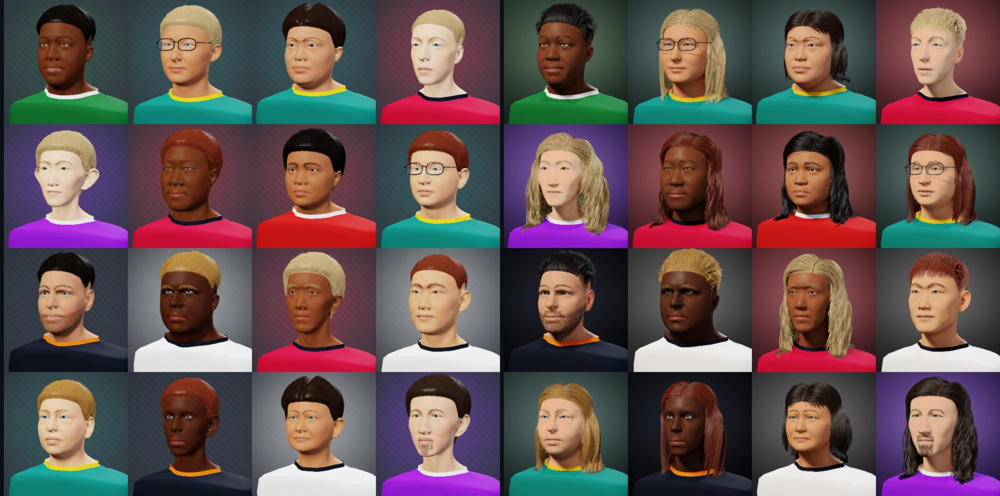
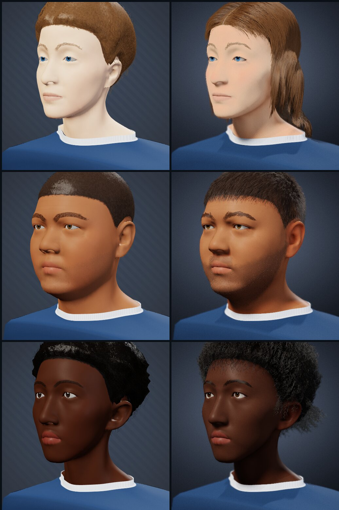
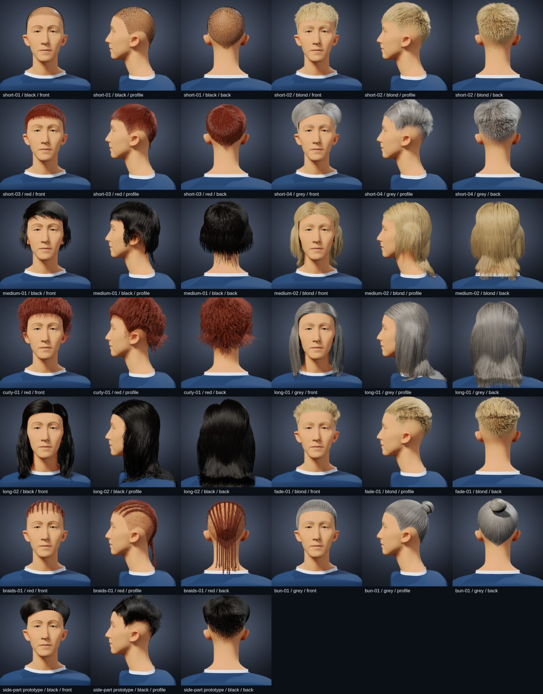
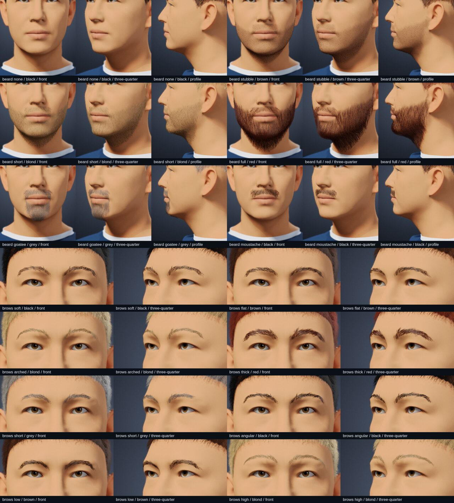
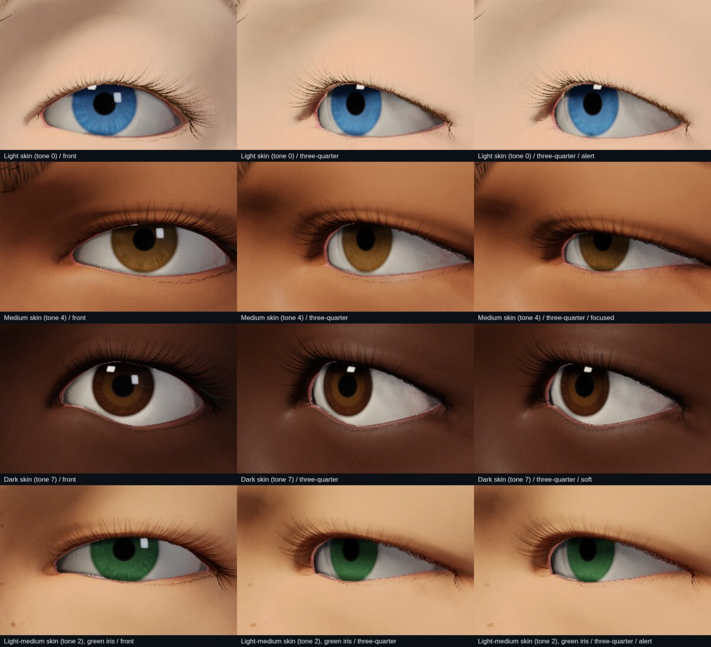

# Sports GNM 3D Player

**Sports GNM 3D Player v1 is the only renderer.** It draws a procedural, real-time WebGL2 portrait of a football player with studio lighting, strand hair and strand grooming. 2D renderers, prototype WebGL viewers, Basis Lab and the SVG fallback have been removed.

## Screenshots

Same seeds and same cameras, before (left) and after (right) the realism pass:





<details>
<summary><strong>Hairstyles</strong>: 12 catalog styles plus the side-part prototype, front, profile and back</summary>



</details>

<details>
<summary><strong>Beards and eyebrows</strong>: 6 beard styles and 8 eyebrow styles</summary>



</details>

<details>
<summary><strong>Eyes</strong>: lashes, tear line and iris detail for four iris colours</summary>



</details>

Full-resolution evidence, techniques and known limits are in the [realism notes](docs/gnm-3d-player/REALISM.md). This is stylized real-time rendering, not photorealism.

## What the renderer does

| Area | Technique |
| --- | --- |
| Lighting | Soft key-light shadows (PCSS), per-player GPU ambient occlusion, procedural studio environment projected to spherical harmonics |
| Skin | Pre-integrated subsurface scattering, dual specular lobes, regional colour (redness, under-eye darkening, beard shadow) |
| Eyes | Clumped eyelashes, tear line, caruncle, iris fibres and limbal ring, corneal catchlights |
| Hair | Strand grooms with head, ear, neck and shoulder collisions, Marschner-style shading and strand shadows |
| Beard and eyebrows | Strands with regional growth direction, soft edges and the same fibre shading as the hair |
| Camera | Offscreen 4× MSAA HDR pipeline, filmic tone mapping, subtle depth of field, grain, vignette and studio backdrop |

Strands and ambient occlusion are generated once per player and cached, so orbiting the camera only redraws.

## Run

```sh
npm run serve
```

Open **http://localhost:8080/**. Both `index.html` (generated bundle) and `index.module.html` (ES modules) require HTTP and a browser with WebGL2. Opening `file://` is not supported: the player fetches local binary assets. Windows users can run `iniciar-servidor.bat`.

Generate a player, edit FaceDNA traits, change age, presentation, kit and micro-expression, orbit/zoom the camera, select a gallery player, share an SF2 code or export a PNG. Renderer preferences from older versions are ignored; existing FaceDNA/SF2 data remains supported.

Expand **Catálogo de estilos** for 12 hairstyles, 6 beard styles and 8 eyebrow styles with actual-render thumbnails. Local controls preserve the rest of the face. SF2 codes remain supported, but the corrected v2-local mapping can render older codes differently. See [feature isolation and catalog evidence](docs/gnm-3d-player/feature-isolation/README.md).

When WebGL2 or required assets are unavailable, the application displays a persistent error and disables PNG export. It never silently substitutes another renderer. Gallery canvases are 2D copies of actual 3D renders, not a separate portrait implementation.

## Develop and verify

```sh
npm run build:offline                 # regenerate src/app.bundle.js (still requires HTTP assets)
npm test                             # model, 3D player, lighting, eyes, post, hair, asset and offline pipeline tests
npm run test:browser-smoke            # Playwright + Chromium; both entrypoints and failures
npm run refresh:release
npm run refresh:checksums
```

The browser smoke needs `uv`, Python, Playwright and Chromium (`CHROMIUM_PATH` can override `/usr/bin/chromium`). The npm browser command uses the installed webapp-testing server helper; alternatively start `npm run serve` and run `python3 tests/browser_smoke.py` in an environment with Playwright.

To regenerate the screenshots, keep `npm run serve` running and use `tools/gnm/capture_player_gallery.py` (gallery) or `tools/gnm/capture_realism_closeups.py --output <png> [--mode ...]` (close-ups, lighting, eyes, post effects, hair and grooming). The [GNM tools guide](tools/gnm/README.md) lists every mode.

| Area | Files |
| --- | --- |
| Profile format and compatibility | `src/face-model.js` |
| Player geometry and appearance | `src/gnm-player-model.js`, `src/player-expression.js` |
| WebGL2 rendering and shared thumbnail context | `src/gnm-player-renderer.js` |
| Shadows, ambient occlusion, environment and skin shading math | `src/gnm-player-lighting.js` |
| Eyes and eyelashes | `src/gnm-player-eyes.js` |
| Tone mapping, depth of field and grain | `src/gnm-player-post.js` |
| Strand scalp hair | `src/gnm-player-hair.js` |
| Strand beard and eyebrows | `src/gnm-player-facial-hair.js` |
| GLB validation and SHA-256 | `src/gnm-assets.js` |
| Single rendering route and PNG export | `src/render-router.js` |
| UI | `src/app.js`, `index.html`, `index.module.html` |
| Offline generation and provenance | [GNM tools](tools/gnm/README.md) |

## Assets and licenses

Runtime downloads only `gnm-official-head-render.glb`, `gnm-player-generator.json` and `gnm-player-generator.bin` from `tools/gnm/work/`. Materials, hair and grooming are generated in code; no textures or external assets are downloaded. The canonical full GNM asset and offline source datasets are preserved but are not loaded by the application. Some canonical-asset regeneration tests explicitly skip when the Git LFS object is absent; this does not skip player runtime validation.

Project code: GPL-2.0-only. Official GNM-derived assets: Apache-2.0 with recorded project-owner noncommercial authorization. No official texture bundle is included. See [third-party notices](THIRD_PARTY_NOTICES.md), [FaceDNA specification](docs/FACE_DNA_V2_SPEC.md) and [3D player acceptance](docs/ACCEPTANCE_GNM_3D_PLAYER.md).
